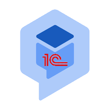
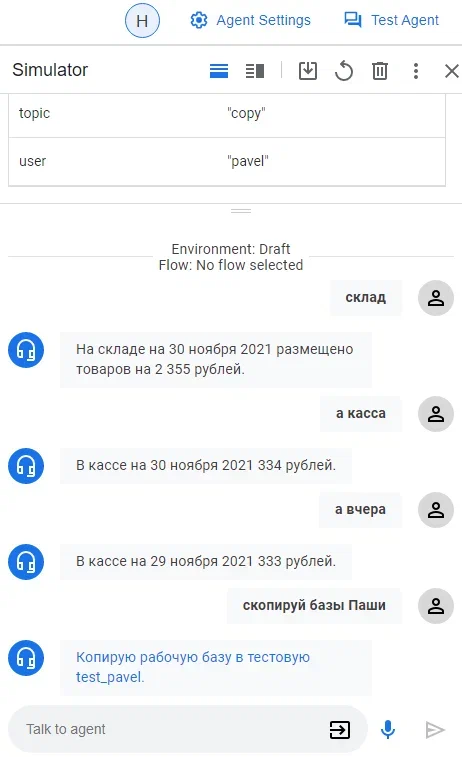

 
Пример интеграции Dialogflow CX с 1С. Dialogflow – это платформа от Google для понимания естественного языка.


После этой статьи можно будет создать своего чат-бота способного понимать контекст и выделять нужные переменные из произвольных фраз.

https://www.youtube.com/watch?v=EfDE2LBgTog

### Видеоинструкция

// видеоинструкция

### Необходимые знания
- Публикация 1С на веб-сервере
- Сети, DNS, переадресация портов
- Docker

### Демо база 1С
Скачиваем [dt демо базы](https://github.com/HardAndHeavy/demo_dialog/releases/download/v1/demo_dialog_v1.dt) и разворачиваем его.

Публикуем базу на веб-сервере с именем `demo_dialog`.

Проверяем публикацию по ссылке http://localhost/demo_dialog/hs/dialog. В появившемся окне аутентификации вводим *Имя пользователя* — `dialog`, *Пароль* — `dialog`. Ответом сервера должен быть текст  — *Демонстрационный сервис интеграции 1C c Google Assistant.*, который говорит, что публикация демо базы прошла успешно.

### Dialogflow CX. Настройка
На сайте [Dialogflow CX](https://dialogflow.cloud.google.com/cx/projects) создаём новый проект нажав кнопку *New Project*. Вводим имя *Project name* — `demo-dialog`, расположение *Location* — `No organization` и нажимаем *CREATE*. После чего мы будем автоматически переведены в консоль [Google Cloud Platform](https://console.cloud.google.com/) на только что созданный проект.

В консоли [Google Cloud Platform](https://console.cloud.google.com/) в меню *IAM & Admin* выбираем *Service accounts*. Создаём новый сервисный аккаунт нажав на *CREATE SERVICE ACCOUNT*. В разделе *Service account details* вводим имя *Service account name* — `demo-dialog`, *Service account* — `demo-dialog` и нажимаем *CREATE AND CONTINUE*. В разделе *Grant this service account access to project* выбираем роль `Dialogflow Service Agent`, которая располагается в быстром доступе *Currently Used*, и нажимаем *CONTINUE*. Дополнительный раздел *Grant users access to this service account* пропускаем и нажимаем *DONE*. В разделе сервисных аккаунтов *Service accounts* появится новая строка с *Email*. Этот *Email* будет являться значением константы `DF_CLIENT_EMAIL`.

Переходим в управление сервисным аккаунтом нажав на *Email*. Выберем раздел *KEYS* и добавляем новый ключ нажав *ADD KEY* и *Create new key*. В появившемся окне выбираем тип ключа *Key type* — `JSON` и нажимаем *CREATE*. Открываем автоматически загруженный файла JSON и копируем значение поля *private_key*. На рабочем столе создаем файл *dialogflow.key* и вставляем в него содержимое буфера заменяя `\n` на реальный перевод строки.

Возвращаемся на сайт [Dialogflow CX](https://dialogflow.cloud.google.com/cx/projects) и выбираем наш проект *demo-dialog*. Далее включаем API нажав кнопку *Enable API*.

Создаём нового агента нажав кнопку *Create agent*. Вводим имя *Display name* — `demo-dialog`, район *Location* — `us-central1`, часовой пояс *Time zone* — `(GMT+3:00) Europe/Moscow`, язык — `ru — Russian` и нажимаем *Create*.

### Файл окружения
На рабочем столе создадим файл окружения *env.txt*:
```
NODE_ENV=production
BASE_1C_HOST=http://ИМЯ_МАШИНЫ_1С/demo_dialog/hs/dialog
BASE_1C_USERNAME=dialog
BASE_1C_PASSWORD=dialog
BASE_1C_TOKEN=base-1c-token
DIALOG_TOKEN=dialog-token
DF_CLIENT_EMAIL=сервисный аккаунт
DF_PROJECT_ID=ID проекта
DF_LOCATION=us-central1
DF_AGENT_ID=ID агента
DF_LANGUAGE_CODE=ru
```
- `NODE_ENV` — внутренняя константа проекта. Необходимо указать `production`
- `BASE_1C_HOST` — URL http-сервиса 1С. Важно указать имя (или ip) машины на которой опубликована база 1С, а не писать `localhost`
- `BASE_1C_USERNAME` — пользователь http-сервиса
- `BASE_1C_PASSWORD` — пароль пользователя http-сервиса
- `BASE_1C_TOKEN` — внутренний ключ для работы http-сервиса. В базе 1С он хранится в константе *Dialog base-1c-token*
- `DIALOG_TOKEN` — внешний ключ для работы http-сервиса. В базе 1С он хранится в константе *Dialog dialog-token*
- `DF_CLIENT_EMAIL` — сервисный аккаунт. Настраивается в *Google Cloud Platform* в меню *Service accounts*
- `DF_PROJECT_ID` — ID проекта. Можно найти в URL после projects
- `DF_LOCATION` — область в которой был размещен агент
- `DF_AGENT_ID` — ID агента. Можно найти в URL после agents
- `DF_LANGUAGE_CODE` — язык, для русского надо указать `ru`

### SSL сертификат
Если нет сертификата, то самый быстрый способ — это создать самоподписанный SSL сертификат. Сделаем это через *openssl*, который прилагается при установке *git*. На рабочем столе создадим каталог *%USERPROFILE%/Desktop/certs* и запустим команду:
```bash
"C:/Program Files/Git/usr/bin/openssl.exe" ^
req -x509 -nodes -sha256 -days 365 ^
-keyout %USERPROFILE%/Desktop/certs/key.pem ^
-out %USERPROFILE%/Desktop/certs/cert.pem
```
В нашем каталоге появится два файла *key.pem* и *cert.pem*.

### Docker контейнер hardandheavy/dialog
После [установки Docker](https://docs.docker.com/desktop/windows/install/) запускаем команду:
```bash
docker run ^
	-v %USERPROFILE%/Desktop/dialogflow.key:/etc/dialogflow.key ^
	--env-file %USERPROFILE%/Desktop/env.txt ^
	-v %USERPROFILE%/Desktop/certs:/certs ^
	-p 3000:3000 ^
	hardandheavy/dialog
```
Проверяем публикацию по ссылке https://localhost:3000/. Ответом сервера должен быть текст — *Сервис для интеграции 1C и Dialogflow CX. Версия 1.0.0.*, который говорит, что контейнер успешно развёрнут. 

Дополнительно:
- Порт можно заменить на другой изменив в команде значение настройки *p* `-p НУЖНЫЙ_ПОРТ:3000`
- Для обновления контейнера используется команда `docker pull hardandheavy/dialog`
- Исходный код контейнера расположен на сайте https://github.com/HardAndHeavy/dialog

### Переадресация портов
Для машины, на который запущен контейнер, открываем доступ из интернета к 3000 (`НУЖНЫЙ_ПОРТ`) порту. Устанавливаем доменное имя. Итоговым результатом будет `ВНЕШНИЙ_URL_СЕРВИСА` вида https://ДОМЕННОЕ_ИМЯ/webhook-df.

### Dialogflow CX. Manage. Webhooks
Переходим в раздел *Webhooks*. Нажимаем кнопку *Create new*. Вводим *Display name* — `webhook`, *Webhook URL* — `ВНЕШНИЙ_URL_СЕРВИСА`. Для аутентификации вводим ключ *Key* — `dialog-token`, *Value* — значение константы `DIALOG_TOKEN`. Нажимаем *Save*.

### Dialogflow CX. Manage. Entity Types
Переходим в раздел *Entity Types*. Нажимаем кнопку *Create*. Вводим *Display name* — `topic`, и создаём новые значения перечисления:
- `store` — store; склад; остаток склада
- `money` — money; деньги; касса; остаток денег
- `copy` — copy; скопируй; копировать; копия; скопировать; сделай копию

Нажимаем *Save*.

Нажимаем кнопку *Create*. Вводим *Display name* — `user`, и создаём новые значения перечисления:
- `i` — i; я; меня; мою
- `ivan` — ivan; Иван; Ваня; Ваниной
- `pavel` — pavel; Павел; Паша; Пашиной
- `alexander` — alexander; Саша; Александр; Сашиной

Нажимаем *Save*.

### Dialogflow CX. Manage. Intents
Переходим в раздел *Intents*. Нажимаем кнопку *Create*. Вводим *Display name* — `request` и создаём тренировочные фразы:
- какой остаток склада
- какая была вчера касса
- какой остаток денег сегодня
- скажи кассу
- касса   
- склад сегодня
- в октябре
- касса 01.09
- на 09.2021
- склад 1.05.21
- а вчера
- скопируй
- сделай копию Пашиной базы
- скопируй базу для Саши
- скопируй для меня
- скопируй Ване
- 25 июля

Корректируем имена параметров:
- `topic` с типом `topic`
- `date` с типом `sys.date-time`
- `user` с типом `user`

**Замечание!** Имя параметра не должно содержать символа тире `-`.

Поправляем нейронную сеть указывая правильное соответствие слов переменным.

Нажимаем *Save*.


Нажимаем кнопку *Create*. Вводим *Display name* — `goodbye` и создаём тренировочные фразы:
- пока
- спасибо
- до свидания
- стоп
- остановись
- конец

Нажимаем *Save*.

### Dialogflow CX. Build 
В разделе *PAGES* создаём страницу `Dialogue`. Рядом с именем страницы нажимаем на три точки, а затем на *Edit*.

Нажимаем *Edit fulfillment*. Включаем вебхук *Enable webhook*. Выбираем из списка вебхук `webhook`. В поле *Tag* вводим `request` и нажимаем *Save*. Нажимаем на *Routes*.

Нажимаем *Add route*. *Intent* выбираем `request`. В разделе *Transition* выбираем `Dialogue` и нажимаем *Save*.

В разделе *Routes* нажимаем *Add route*. *Intent* выбираем `goodbye`. В разделе *Transition* выбираем `End Session` и нажимаем *Save*.

Рядом с именем страницы *Start* нажимаем на три точки, а затем на *Edit*.

Нажимаем на *Routes*. Нажимаем *Add route*. *Intent* выбираем `request`. В разделе *Transition* выбираем `Dialogue` и нажимаем *Save*.

### Dialogflow CX. Test Agent



### 1С. Тестирование

В константе *Dialog имя сервера* указываем ДОМЕННОЕ_ИМЯ для связи с нашим контейнером. Открываем обработку *Demo Dialog* и получаем все возможности диалога.

https://www.youtube.com/watch?v=EfDE2LBgTog

### Собственная разработка в 1С
Точкой входа для изучения механизма будет метод [request](https://github.com/HardAndHeavy/demo_dialog/blob/3b261c99092876e9cb132dfb04c837d2027ff7c9/demo_dialog/src/HTTPServices/Dialog/Module.bsl#L131). В нём происходит работа с параметрами (params), пользовательскими данными (payload) и контекстом (session).
