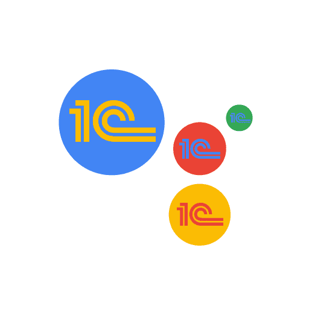
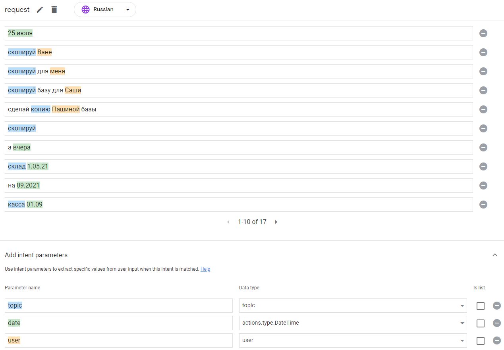
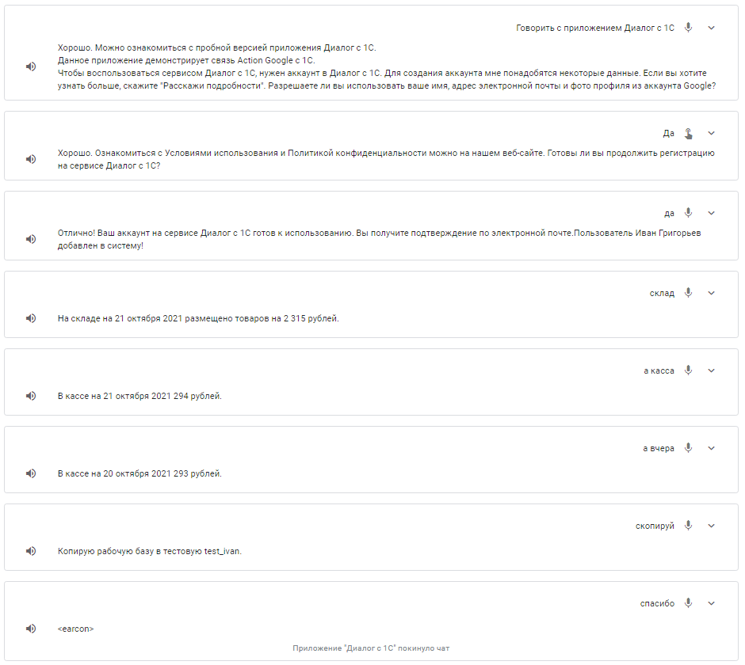

 
Пример интеграции Google Ассистента с 1С. В основе которого лежит платформа Dialogflow CX для понимания естественного языка.


После этой статьи можно будет создать своего чат-бота способного понимать контекст и выделять нужные переменные из произвольных фраз.

https://youtu.be/JJy0GWBDa3E

### Видеоинструкция

### Необходимые знания
- Публикация 1С на веб-сервере
- Сети, DNS, переадресация портов
- Docker

### Демо база 1С
Скачиваем [dt демо базы](https://github.com/HardAndHeavy/demo_dialog/releases/download/v1/demo_dialog_v1.dt) и разворачиваем его.

Публикуем базу на веб-сервере с именем `demo_dialog`.

Проверяем публикацию по ссылке http://localhost/demo_dialog/hs/dialog. В появившемся окне аутентификации вводим *Имя пользователя* — `dialog`, *Пароль* — `dialog`. Ответом сервера должен быть текст  — *Демонстрационный сервис интеграции 1C c Google Assistant.*, который говорит, что публикация демо базы прошла успешно.

### Google Ассистент. Настройка
На сайте [Actions Console](https://console.actions.google.com/u/0/) создаём новый проект нажав кнопку *New project*. Вводим имя проекта `demo-dialog`, язык — `Russian`, страна — `Russia` и нажимаем *Create project*.

В стартовом окне выбираем тип `Custom` и нажимаем *Next*. Проект создадим с нуля, поэтому выбираем `Blank project` и нажимаем *Start building*.

В разделе настроек *Settings* указываем имя *Display name* — `Диалог с 1С` и нажимаем *Save*. 

В разделе связывания аккаунта *Account linking* переводим переключатель в активное положение. Отвечаем положительно `Yes` на вопрос регистрации голосом *Do you want to allow users to sign up for new accounts via voice?* и нажимаем *Next*. Тип связывания *Linking type* выбираем `Google Sign In` и нажимаем *Next*. Запоминаем *Client ID*, мы его будем указывать в константе `AG_CLIENT_ID`, и нажимаем *Save*.

### Файл окружения
На рабочем столе создадим файл окружения *env.txt*:
```
NODE_ENV=production
BASE_1C_HOST=http://ИМЯ_МАШИНЫ_1С/demo_dialog/hs/dialog
BASE_1C_USERNAME=dialog
BASE_1C_PASSWORD=dialog
BASE_1C_TOKEN=base-1c-token
AG_CLIENT_ID=Client ID issued by Google to your Actions
```
- `NODE_ENV` — внутренняя константа проекта. Необходимо указать `production`
- `BASE_1C_HOST` — URL http-сервиса 1С. Важно указать имя (или ip) машины на которой опубликована база 1С, а не писать `localhost`
- `BASE_1C_USERNAME` — пользователь http-сервиса
- `BASE_1C_TOKEN` — внутренний ключ для работы http-сервиса. В базе 1С он хранится в константе *Dialog base-1c-token*
- `BASE_1C_PASSWORD` — пароль пользователя http-сервиса
- `AG_CLIENT_ID` — *Client ID*, который нам выдал Google Ассистент для связывания аккаунта

### SSL сертификат
Если нет сертификата, то самый быстрый способ — это создать самоподписанный SSL сертификат. Сделаем это через *openssl*, который прилагается при установке *git*. На рабочем столе создадим каталог *%USERPROFILE%/Desktop/certs* и запустим команду:
```bash
"C:/Program Files/Git/usr/bin/openssl.exe" ^
req -x509 -nodes -sha256 -days 365 ^
-keyout %USERPROFILE%/Desktop/certs/key.pem ^
-out %USERPROFILE%/Desktop/certs/cert.pem
```
В нашем каталоге появится два файла *key.pem* и *cert.pem*.

### Docker контейнер hardandheavy/dialog
После [установки Docker](https://docs.docker.com/desktop/windows/install/) запускаем команду:
```bash
docker run ^
	--env-file %USERPROFILE%/Desktop/env.txt ^
	-v %USERPROFILE%/Desktop/certs:/certs ^
	-p 3000:3000 ^
	hardandheavy/dialog
```
Проверяем публикацию по ссылке https://localhost:3000/. Ответом сервера должен быть текст — *Сервис для интеграции 1C и Dialogflow CX. Версия 1.0.0.*, который говорит, что контейнер успешно развёрнут.

Дополнительно:
- Порт можно заменить на другой изменив в команде значение настройки *p* `-p НУЖНЫЙ_ПОРТ:3000`
- Для обновления контейнера используется команда `docker pull hardandheavy/dialog`
- Исходный код контейнера расположен на сайте https://github.com/HardAndHeavy/dialog

### Переадресация портов
Для машины, на который запущен контейнер, открываем доступ из интернета к 3000 (`НУЖНЫЙ_ПОРТ`) порту. Устанавливаем доменное имя. Итоговым результатом будет `ВНЕШНИЙ_URL_СЕРВИСА` вида https://ДОМЕННОЕ_ИМЯ/webhook-ag.

### Google Ассистент. Develop. Webhook
Переходим в раздел *Webhook*. В открывшемся окне выбираем метод выполнения *Fulfillment Methods* — `HTTPS endpoint` и нажимаем *Confirm*. В поле *HTTPS endpoint* вводим `ВНЕШНИЙ_URL_СЕРВИСА`.

### Google Ассистент. Develop. Блок-схема
Переходим в раздел *Main invocation*. В блоке *Диалог с 1С* меняем *speech* на `Данное приложение демонстрирует связь Action Google с 1С.`. В переходе *Transition* набираем `AccountLinkingOrigin` и нажимаем *Add*. Нажимаем *Save*.

Переходим на сцену *AccountLinkingOrigin*. В обработчике *Condition* нажимаем плюс. В условии *if* вводим `user.accountLinkingStatus == "LINKED"`. В переходе *Transition* набираем `Dialogue` и нажимаем *Add*. В обработчике *Condition* нажимаем плюс. В условии *else if* вводим `user.accountLinkingStatus != "LINKED"`. В переходе *Transition* выбираем сцену `Account linking`. Нажимаем *Save*.

Переходим на сцену *AccountLinkingOrigin_AccountLinking*. В обработчике *Condition* для условия *If user successfully completes account linking* включаем *Call your webhook* и вводим `create_user`. В переходе *Transition* выбираем сцену `AccountLinkingOrigin`. В обработчике *Condition* для условия *If user cancels or dismisses account linking* в переходе *Transition* выбираем сцену `End conversation`. В обработчике *Condition* для условия *If system or network error occurs* в переходе *Transition* выбираем сцену `End conversation`. Нажимаем *Save*.

Переходим на сцену *Dialogue*. В обработчике *User intent handling* нажимаем плюс. В поле *Intent* набираем `request` и нажимаем *Add*. Включаем *Call your webhook* и вводим `request`. В переходе *Transition* выбираем сцену `Dialogue`. В обработчике *User intent handling* нажимаем плюс. В поле *Intent* набираем `goodbye` и нажимаем *Add*. Включаем *Call your webhook* и вводим `goodbye`.  В переходе *Transition* выбираем сцену `End conversation`. Нажимаем *Save*.

### Google Ассистент. Develop. Типы
В разделе типов *Types* нажимаем плюс и вводим `topic`. В разделе *Add entries* создаём перечисления:
- `store` — store; склад; остаток склада
- `money` — money; деньги; касса; остаток денег
- `copy` — copy; скопируй; копировать; копия; скопировать; сделай копию

Нажимаем *Save*.

В разделе типов *Types* нажимаем плюс и вводим `user`. В разделе *Add entries* создаём перечисления:
- `i` — i; я; меня; мою
- `ivan` — ivan; Иван; Ваня; Ваниной
- `pavel` — pavel; Павел; Паша; Пашиной
- `alexander` — alexander; Саша; Александр; Сашиной

Нажимаем *Save*.

### Google Ассистент. Develop. Тренировка фраз
В разделе *Custom Intents* переходим на намерение `request`.

Добавляем три параметра в разделе *Add intent parameters*:
- `topic` с типом `topic`
- `date` с типом `actions.type.DateTime`
- `user` с типом `user`

**Замечание!** Имя параметра не должно содержать символа тире `-`.

Добавляем тренировочные фразы в разделе *Add training phrases* и поправляем нейронную сеть указывая правильное соответствие слов переменным:
- какой остаток склада
- какая была вчера касса
- какой остаток денег сегодня
- скажи кассу
- касса
- склад сегодня
- в октябре
- касса 01.09
- на 09.2021
- склад 1.05.21
- а вчера
- скопируй
- сделай копию Пашиной базы
- скопируй базу для Саши
- скопируй для меня
- скопируй Ване
- 25 июля

Нажимаем *Save*.



В разделе *Custom Intents* переходим на намерение `goodbye`.
Добавляем тренировочные фразы в разделе *Add training phrases*:
- пока
- спасибо
- до свидания
- стоп
- остановись
- конец

Нажимаем *Save*.

### Google Ассистент. Test


### Google Ассистент. Deploy
В разделе *Directory information* заполняем: описание, изображение, контактные данные, политику конфиденциальности. Дополняем *Additional invocation phrases* согласно [документации фраз запуска приложения](https://developers.google.com/assistant/console/languages-locales). Заполняем дополнительную информацию и нажимаем *Save*.

В разделе *Release* публикуем проект. Нажимаем *Start new release*, выбираем канал `Alpha` и нажимаем *Submit*. И на это всё. В личном смартфоне можно запустить наше приложение произвольной фразой. Например, можно сказать: *Окей, Google, давай поговорим с приложением Диалог с 1С*.

### Собственная разработка в 1С
Точкой входа для изучения механизма будет метод [request](https://github.com/HardAndHeavy/demo_dialog/blob/3b261c99092876e9cb132dfb04c837d2027ff7c9/demo_dialog/src/HTTPServices/Dialog/Module.bsl#L131). В нём происходит работа с параметрами (params), пользовательскими данными (payload) и контекстом (session).

### Заключение
Данная статья затрагивает работу с платформой Dialogflow CX лишь через интерфейс "Окей, Google". Но на этом возможности контейнера [hardandheavy/dialog](https://github.com/HardAndHeavy/dialog) и [демонстрационной конфигурации](https://github.com/HardAndHeavy/demo_dialog) не заканчиваются. Продолжение следует...